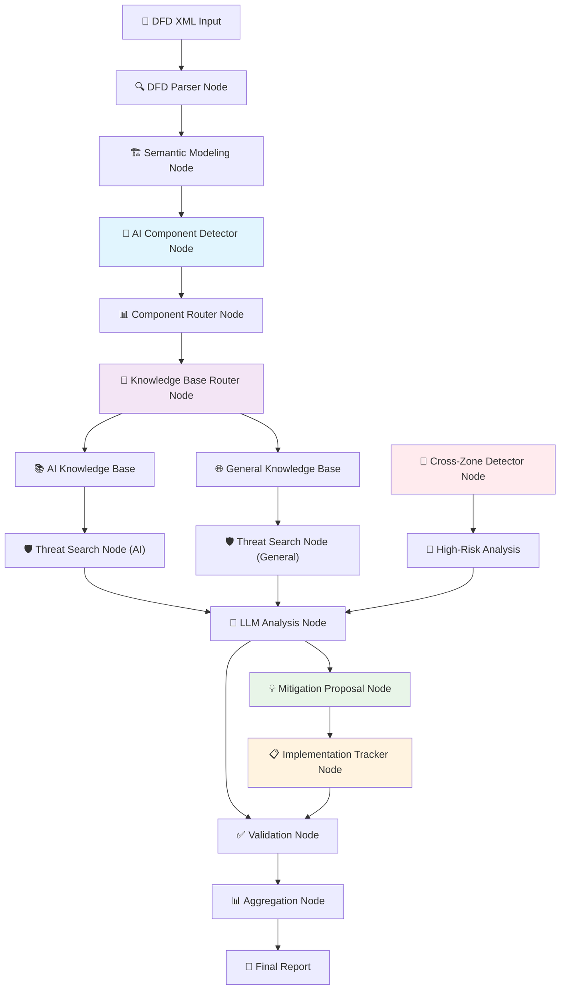
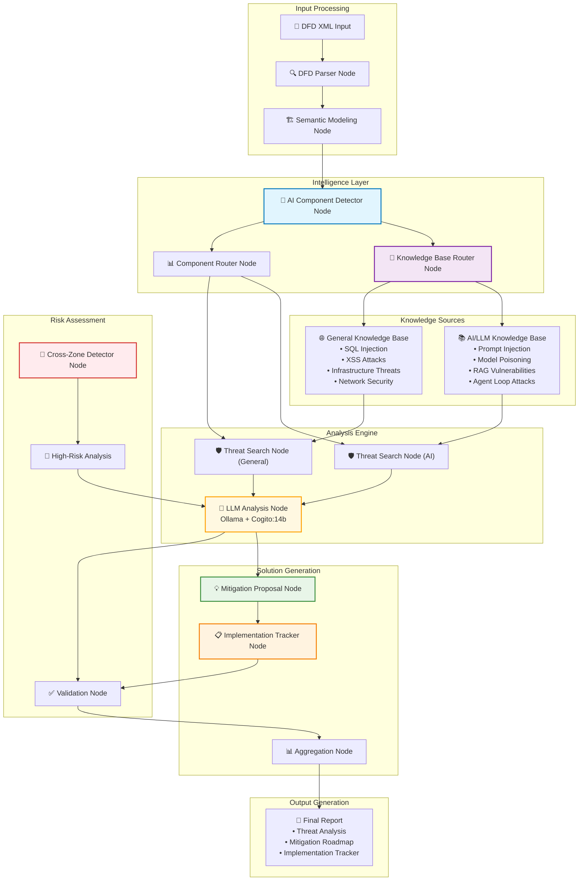

# FRAITMO - Framework for Robust AI Threat Modeling Operations

A modular framework to automate threat modeling for Agentic AI / LLM-based systems.  
It parses DFDs, builds semantic models, and leverages **Ollama + RAG** to identify and contextualize threats from a structured knowledge base.

**✨ New: LangGraph-based orchestration with AI-aware threat analysis**

---

## 🎯 Objectives

- **Parse DFD diagrams** (XML format from draw.io or IriusRisk)
- **Extract components, connections, and trust boundaries**
- **Build a semantic representation** of the architecture
- **Detect AI/LLM/Agentic components** automatically
- **Use specialized knowledge bases** for AI vs traditional infrastructure
- **Analyze threats contextually** using local LLMs (Cogito 14B)
- **Generate actionable mitigations** with implementation roadmaps
- **Track implementation progress** with detailed reporting

---

## 🚀 Quick Start

### 1. Prerequisites
- **Ollama installed** ([download here](https://ollama.ai/))
- **Python 3.9+**
- **macOS with Apple Silicon** (recommended)

### 2. Install Dependencies
```bash
pip install -r requirements.txt
```

### 3. Setup Ollama
```bash
# Pull recommended model for threat modeling
ollama pull cogito:14b
```

### 4. Run Threat Analysis
```bash
python fraitmo.py your_diagram.xml
```

---

## 🐳 Docker Setup (Alternative)

For isolated deployment with automated Ollama and model setup:

### Prerequisites
- Docker and Docker Compose installed
- 8GB+ available RAM for the model

### Setup Commands
```bash
# Create necessary directories
mkdir -p output test_data

# Build the application
docker-compose build

# Start Ollama service
docker-compose up -d ollama

# Wait for Ollama to initialize (10-15 seconds)
sleep 15

# Download the model (this will take several minutes)
docker-compose up model-downloader

# Run the FRAITMO application
docker-compose up fraitmo
```

### Useful Docker Commands
```bash
# View application logs
docker-compose logs -f fraitmo

# View Ollama service logs  
docker-compose logs -f ollama

# Stop all services
docker-compose down

# Restart only the application
docker-compose up fraitmo
```

---

## 📂 Project Structure

```
fraitmo/
├── fraitmo.py                     # Main CLI entry point
├── requirements.txt               # Dependencies (ollama, pydantic, langgraph, etc.)
│
├── dfd_parser/                    # DFD XML parsing
│   └── xml_parser.py
│
├── models/                        # Semantic data models
│   ├── builder.py                 # DFD builder
│   └── schema.py                  # Pydantic schemas
│
├── rag/                          # RAG threat analysis system
│   ├── document_loader.py        # Knowledge base loader
│   ├── ollama_client.py          # Ollama LLM client
│   ├── threat_analyzer.py        # Core threat analysis engine
│   └── __init__.py
│
├── knowledge_base/               # Threat knowledge base (JSON)
│   ├── ai_threats/              # AI/LLM specific threats
│   │   ├── rag_inj.json         # RAG injection threats
│   │   ├── plugin_function_calling.json
│   │   ├── agent_loop.json
│   │   └── llm_vulnerabilities.json
│   └── general_threats/         # Traditional web/infra threats
│       ├── web_attacks.json
│       ├── infra_threats.json
│       └── network_security.json
│
├── pipeline/                     # LangGraph orchestration
│   ├── graph.py                  # Pipeline definition
│   ├── state.py                  # Shared state schema
│   ├── nodes/                    # Individual processing nodes
│   │   ├── ai_detector.py        # AI component detection
│   │   ├── kb_router.py          # Knowledge base routing
│   │   ├── mitigation_proposer.py # Mitigation generation
│   │   └── tracker.py            # Implementation tracking
│   └── workflows/                # Complete workflows
│       └── threat_analysis.py
│
└── exporter/                     # Report generation
    ├── json_exporter.py
    ├── markdown_exporter.py
    └── implementation_tracker.py
```

---

## 🧠 Technologies Used

- **Python 3.9+** – Core language
- **LangGraph** – Orchestration and workflow management
- **Ollama** – Local LLM serving (Cogito:14b)
- **Pydantic** – Data validation and semantic modeling
- **JSON** – Knowledge base format
- **RAG** – Retrieval-Augmented Generation for threat analysis

---

## 🔄 LangGraph Architecture

### Node-Based Orchestration Flow



### Detailed Architecture Overview



### Core LangGraph Nodes

#### **🔍 Processing Nodes**
- **`parse_dfd_node`**: Parses DFD XML into structured data
- **`semantic_modeling_node`**: Builds relationships and metadata
- **`ai_component_detector_node`**: Identifies AI/LLM/Agentic components
- **`threat_search_node`**: Searches relevant knowledge base
- **`llm_analysis_node`**: Contextualizes threats with Ollama

#### **🧠 Intelligence Nodes**
- **`knowledge_base_router_node`**: Routes to AI vs General knowledge base
- **`mitigation_proposal_node`**: Generates actionable mitigations
- **`implementation_tracker_node`**: Creates implementation roadmaps

#### **🎛️ Control Nodes**
- **`component_router_node`**: Manages parallel component analysis
- **`cross_zone_detector_node`**: Identifies high-risk connections
- **`validation_node`**: Ensures analysis completeness
- **`aggregation_node`**: Consolidates results

### State Management

**Shared State Schema:**
```python
class ThreatAnalysisState(TypedDict):
    dfd_model: DataFlowDiagram
    component_classification: Dict[str, str]  # AI vs Traditional
    analysis_results: Dict[str, List[Dict]]
    ai_knowledge_base: List[Dict]
    general_knowledge_base: List[Dict]
    mitigation_catalog: List[Dict]
    implementation_roadmap: Dict[str, Any]
    ollama_client: OllamaRAGClient
```

---

## 🛡️ AI-Aware Threat Analysis

### Intelligent Component Detection

FRAITMO automatically detects AI/LLM/Agentic components using pattern recognition:

**AI Component Indicators:**
- Component names containing: `llm`, `gpt`, `claude`, `ai`, `agent`, `model`
- Component types: `LLM Service`, `AI Agent`, `ML Model`, `Chatbot`
- Vendor indicators: `OpenAI`, `Anthropic`, `Hugging Face`, `Ollama`

**Traditional Component Indicators:**
- Standard web/infra patterns: `database`, `api`, `cache`, `load balancer`
- Cloud services: `AWS`, `GCP`, `Azure` (non-AI services)

### Specialized Knowledge Base Routing

**AI/LLM Knowledge Base:** 
- Prompt injection attacks
- Model poisoning
- RAG vulnerabilities
- Agent loop attacks
- Function calling abuse

**General Knowledge Base:**
- SQL injection
- XSS attacks
- Infrastructure vulnerabilities
- Network security threats
- Traditional web attacks

### Enhanced Mitigation Generation

**Context-Aware Mitigations:**
- **For AI Components**: Input validation, output filtering, rate limiting
- **For Traditional Components**: Standard security controls, patches, configurations
- **Cross-Component**: Trust boundary enforcement, data flow validation

---

## 💡 Usage Examples

### Basic Threat Analysis
```bash
python fraitmo.py diagram.xml
```

### Sample Output (Enhanced)
```
🛡️ FRAITMO THREAT ANALYSIS RESULTS
============================================================

🤖 AI COMPONENT DETECTION:
   ✅ AI Components: llm_service, ai_agent, chatbot_api
   📊 Traditional Components: user_database, web_server, cache

📊 ANALYSIS SUMMARY:
   Total threats found: 12
   AI-specific threats: 7
   Traditional threats: 5
   Cross-zone threats: 2

🧠 AI COMPONENT THREATS:

   Component: llm_service (AI/LLM)
   ⚠️  Prompt Injection via RAG
      📝 Malicious documents in RAG knowledge base can manipulate LLM responses...
      🤖 Analysis: This AI service processes user queries through RAG, making it 
          vulnerable to document injection attacks that could corrupt responses...
      🛠️  Mitigations:
          • Input sanitization (Priority: High, Effort: Medium)
          • Document content validation (Priority: High, Effort: Low)
          • Output filtering (Priority: Medium, Effort: Low)

🌐 TRADITIONAL COMPONENT THREATS:

   Component: user_database (Traditional)
   ⚠️  SQL Injection
      📝 Unsanitized user inputs can lead to unauthorized database access...
      🤖 Analysis: Standard SQL injection vulnerability in the user database...
      🛠️  Mitigations:
          • Parameterized queries (Priority: Critical, Effort: Low)
          • Input validation (Priority: High, Effort: Low)

📋 IMPLEMENTATION ROADMAP:

   Sprint 1 (Weeks 1-2):
   • Implement parameterized queries for user_database
   • Add input sanitization for llm_service
   
   Sprint 2 (Weeks 3-4):
   • Deploy document validation pipeline
   • Implement output filtering for AI components
   
   Sprint 3 (Weeks 5-6):
   • Cross-zone security validation
   • Monitoring and alerting setup

🎯 NEXT STEPS:
   1. Review and prioritize mitigations
   2. Assign implementation responsibilities
   3. Set up progress tracking
   4. Schedule security testing
```

---

## 🏗️ Knowledge Base Format

### AI/LLM Threats (knowledge_base/ai_threats/)
```json
[
  {
    "id": "LLM01:2025",
    "name": "Prompt Injection via RAG",
    "description": "Malicious documents in RAG knowledge base manipulate LLM responses...",
    "category": "AI/LLM Security",
    "severity": "High",
    "impact": ["Response Manipulation", "Data Exfiltration", "Misinformation"],
    "ai_specific": true,
    "affected_components": ["LLM", "RAG", "AI Agent"],
    "mitigation": [
      {
        "control": "Input Sanitization",
        "priority": "High",
        "effort": "Medium",
        "implementation_time": "2 weeks"
      },
      {
        "control": "Document Validation",
        "priority": "High", 
        "effort": "Low",
        "implementation_time": "1 week"
      }
    ]
  }
]
```

### Traditional Threats (knowledge_base/general_threats/)
```json
[
  {
    "id": "WEB01:2025",
    "name": "SQL Injection",
    "description": "Unsanitized user inputs can lead to unauthorized database access...",
    "category": "Web Application Security",
    "severity": "Critical",
    "impact": ["Data Breach", "Unauthorized Access", "Data Corruption"],
    "ai_specific": false,
    "affected_components": ["Database", "Web API", "Backend Service"],
    "mitigation": [
      {
        "control": "Parameterized Queries",
        "priority": "Critical",
        "effort": "Low",
        "implementation_time": "3 days"
      }
    ]
  }
]
```

---

## 🍎 Apple Silicon Optimization

Optimized for M1/M2 Macs:
- **Ollama** uses Apple Metal acceleration
- **LangGraph** parallel node execution
- **First query slow** (model loading), subsequent queries fast
- **Memory efficient** - ~8GB for Cogito:14b
- **No external API calls** - fully local processing

---

## 📊 System Requirements

- **Hardware**: Apple Silicon Mac (M1/M2) with 8GB+ RAM
- **OS**: macOS 12+ 
- **Python**: 3.9+
- **Ollama**: Latest version
- **Model**: Cogito:14b (recommended)

---

## 🛠️ Development

### Test Individual Components
```bash
# Test Ollama client
python rag/ollama_client.py

# Test LangGraph pipeline
python pipeline/workflows/threat_analysis.py

# Test AI component detection
python pipeline/nodes/ai_detector.py

# Test mitigation generation
python pipeline/nodes/mitigation_proposer.py
```

### Add New Threats
1. Create JSON file in appropriate knowledge base directory
2. Follow the enhanced schema format
3. Restart FRAITMO to reload knowledge base

### Extend Analysis
- Add new AI component patterns in `ai_detector.py`
- Customize mitigation logic in `mitigation_proposer.py`
- Extend knowledge base routing in `kb_router.py`

---

## 🗺️ Roadmap

### ✅ Completed
- [x] **DFD XML parsing and normalization**
- [x] **Semantic model building with Pydantic**
- [x] **RAG-based threat retrieval**  
- [x] **Ollama integration with Cogito 14B**
- [x] **Component and connection threat analysis**
- [x] **Cross-zone boundary detection**
- [x] **Knowledge base management**
- [x] **Contextual threat analysis with LLM**

### 🚧 In Progress
- [ ] **LangGraph pipeline orchestration**
- [ ] **AI component detection system**
- [ ] **Specialized knowledge base routing**
- [ ] **Mitigation proposal generation**
- [ ] **Implementation roadmap tracking**

### 🔮 Future
- [ ] **Interactive threat refinement**
- [ ] **Streamlit web interface**
- [ ] **PDF report generation**
- [ ] **Integration with security tools**
- [ ] **Vector embeddings for better retrieval**
- [ ] **Automated penetration testing**
- [ ] **Continuous monitoring integration**

---

## 🤝 Contributing

1. Fork the repository
2. Add new threats to appropriate knowledge base directory
3. Extend LangGraph nodes for new analysis types
4. Test with sample DFD files
5. Submit pull request

---

## 📄 License

MIT License - Feel free to use and modify for your threat modeling needs.

---

## 🙏 Acknowledgments

- **OWASP LLM Top 10** for AI threat taxonomy
- **Ollama team** for local LLM serving
- **LangGraph team** for orchestration framework
- **Draw.io/IriusRisk** for DFD format support
