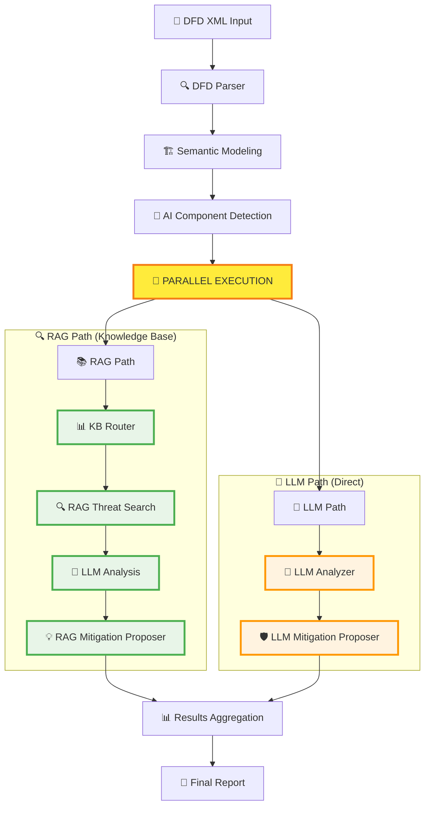

# FRAITMO - Framework for Robust AI Threat Modeling Operations

A modular framework to automate threat modeling for Agentic AI / LLM-based systems.  
It parses DFDs, builds semantic models, and leverages **multiple LLM providers + RAG** to identify and contextualize threats using both structured knowledge bases and direct LLM reasoning.

**✨ New: Unified LLM Client with LM Studio support + Parallel LangGraph Architecture**

---

## 🎯 Objectives

- **Parse DFD diagrams** (XML format from draw.io or IriusRisk)
- **Extract components, connections, and trust boundaries**
- **Build a semantic representation** of the architecture
- **Detect AI/LLM/Agentic components** automatically
- **Use multiple LLM providers** (Ollama, LM Studio) with automatic fallback
- **Leverage specialized cybersecurity models** (Foundation-Sec-8B)
- **Run parallel analysis paths** for comprehensive threat coverage
- **Analyze threats with direct LLM reasoning** independent of knowledge bases
- **Generate actionable mitigations** with implementation roadmaps
- **Track implementation progress** with detailed reporting

---

## 🚀 Quick Start

### 1. Prerequisites
- **LM Studio** ([download here](https://lmstudio.ai/)) **[RECOMMENDED]**
  - OR **Ollama** ([download here](https://ollama.ai/))
- **Python 3.9+**
- **macOS with Apple Silicon** (recommended)

### 2. Install Dependencies
```bash
pip install -r requirements.txt
```

### 3. Setup LLM Provider

#### Option A: LM Studio (Recommended)
```bash
# 1. Download and install LM Studio
# 2. Download the Foundation-Sec-8B-Q4_K_M model from fdtn-ai
# 3. Start the local server (port 1234)
# 4. FRAITMO will auto-detect and prioritize this setup
```

#### Option B: Ollama (Alternative)
```bash
# Pull recommended model for threat modeling
ollama pull cogito:14b
# OR
ollama pull foundation-sec:8b
```

### 4. Run Threat Analysis
```bash
python fraitmo.py your_diagram.xml
```

The system will automatically detect available LLM providers and use the best model for cybersecurity analysis.

---

## 🧠 LLM Provider Support

### Unified LLM Client Architecture

FRAITMO features a **UnifiedLLMClient** that automatically detects and uses the best available LLM provider:

```python
# Auto-detection priority (highest to lowest):
1. Foundation-Sec model on LM Studio (localhost:1234)
2. Foundation-Sec model on Ollama (localhost:11434) 
3. Cogito model on Ollama
4. Any available model on either provider
```

### Supported Providers

#### **🎯 LM Studio (Primary)**
- **URL**: `http://localhost:1234/v1/`
- **Recommended Model**: `fdtn-ai/Foundation-Sec-8B-Q4_K_M-GGUF`
- **Advantages**: 
  - GUI interface for model management
  - Optimized for cybersecurity analysis
  - OpenAI-compatible API
  - Better model curation

#### **🔄 Ollama (Fallback)**
- **URL**: `http://localhost:11434/`
- **Supported Models**: `foundation-sec:8b`, `cogito:14b`, others
- **Advantages**:
  - Command-line simplicity
  - Broad model support
  - Established ecosystem

### Automatic Failover

The system gracefully handles provider failures:
- **Primary fails**: Automatically switches to backup provider
- **Model unavailable**: Falls back to next best available model
- **All providers down**: Clear error messages with setup instructions

---

## 🏗️ Enhanced Parallel LangGraph Architecture

### Dual-Path Analysis System with Optimized Node Separation

FRAITMO implements a sophisticated **parallel analysis architecture** with **10 specialized nodes** that combines traditional knowledge base lookup with direct LLM reasoning:



### Enhanced Node Architecture

#### **🔍 RAG Path Nodes (Green)**
| Node | Function | File |
|------|----------|------|
| **KB Router** | Load appropriate knowledge bases (AI vs General) | `kb_router.py` |
| **RAG Threat Search** | Search threats in loaded knowledge bases | `rag_threat_searcher.py` |
| **LLM Analysis** | Contextualize found threats with LLM | `graph.py` |
| **RAG Mitigation Proposer** | Generate mitigations from knowledge base | `rag_mitigation_proposer.py` |

#### **🧠 LLM Path Nodes (Orange)**
| Node | Function | File |
|------|----------|------|
| **LLM Analyzer** | Direct threat analysis using pure LLM reasoning | `llm_analyzer.py` |
| **LLM Mitigation Proposer** | Generate mitigations using direct LLM reasoning | `llm_mitigation_proposer.py` |

### Path Comparison

| Aspect | RAG Path | LLM Path |
|--------|----------|----------|
| **Data Source** | Structured knowledge base | LLM reasoning |
| **Coverage** | Known threat patterns | Comprehensive analysis |
| **Speed** | Fast (database lookup) | Moderate (LLM processing) |
| **Innovation** | Limited to KB content | Creative threat discovery |
| **Reliability** | High (structured data) | High (Foundation-Sec model) |
| **Dependencies** | Requires knowledge_base/ | Independent operation |
| **Node Count** | 4 specialized nodes | 2 specialized nodes |
| **Nomenclature** | `rag_` prefix | `llm_` prefix |

### Benefits of Enhanced Parallel Architecture

1. **Modular Design**: Clean separation of responsibilities with dedicated nodes
2. **Clear Nomenclature**: `rag_` and `llm_` prefixes for immediate identification
3. **Redundancy**: If knowledge base is missing, LLM path still works
4. **Comprehensive Coverage**: Combines structured knowledge with LLM creativity
5. **Performance**: Both paths run simultaneously for faster results
6. **Reliability**: System remains functional even with partial failures
7. **Innovation**: LLM path can discover novel threat patterns
8. **Maintainability**: Easier debugging and extension with specialized nodes

---

## 📂 Enhanced Project Structure

```
fraitmo/
├── fraitmo.py                     # Main CLI with dual-path result display
├── requirements.txt               # Dependencies (requests, ollama, pydantic, langgraph)
│
├── dfd_parser/                    # DFD XML parsing
│   └── xml_parser.py
│
├── models/                        # Semantic data models
│   ├── builder.py                 # DFD builder
│   └── schema.py                  # Pydantic schemas
│
├── rag/                          # Unified LLM and RAG system
│   ├── document_loader.py        # Knowledge base loader
│   ├── llm_client.py             # 🆕 UnifiedLLMClient (LM Studio + Ollama)
│   ├── threat_analyzer.py        # Core threat analysis engine
│   └── __init__.py
│
├── knowledge_base/               # Optional threat knowledge base
│   ├── ai_threats/              # AI/LLM specific threats
│   └── general_threats/         # Traditional web/infra threats
│
├── pipeline/                     # Enhanced LangGraph orchestration
│   ├── graph.py                  # 🔄 Parallel pipeline definition
│   ├── state.py                  # Shared state schema (updated nomenclature)
│   ├── nodes/                    # Processing nodes
│   │   ├── ai_detector.py        # AI component detection
│   │   ├── kb_router.py          # Knowledge base routing
│   │   ├── rag_threat_searcher.py # 🔍 RAG-based threat search (separated)
│   │   ├── rag_mitigation_proposer.py # 📚 RAG mitigation generation
│   │   ├── llm_analyzer.py       # 🧠 LLM threat analysis (renamed)
│   │   ├── llm_mitigation_proposer.py # 🛡️ LLM mitigations (renamed)
│   │   └── tracker.py            # Implementation tracking
│   └── workflows/                # Complete workflows
│       └── threat_analysis.py
│
└── exporter/                     # Report generation
    └── implementation_tracker.py
```

---

## 🧠 LLM Analysis Engine

### Advanced Threat Analysis

The **LLM Analyzer** (`pipeline/nodes/llm_analyzer.py`) performs comprehensive threat analysis without knowledge base dependencies:

#### **🤖 AI/LLM Component Analysis**
- **Prompt Injection**: Input manipulation, context pollution
- **Model Poisoning**: Training data attacks, adversarial inputs
- **RAG Vulnerabilities**: Document injection, retrieval manipulation
- **Agent Loop Attacks**: Infinite loops, resource exhaustion
- **Function Calling Abuse**: Unauthorized API access, privilege escalation

#### **🌐 Traditional Component Analysis**
- **Web Application**: SQL injection, XSS, CSRF
- **Infrastructure**: Network attacks, access control, data exposure
- **Database**: Injection attacks, privilege escalation, data breaches
- **API**: Authentication bypass, rate limiting, input validation

#### **🔗 Cross-Zone Communication Analysis**
- **Trust Boundary Violations**: Unauthorized cross-zone access
- **Data Flow Security**: Encryption, integrity, authentication
- **Network Segmentation**: Firewall bypass, lateral movement
- **Access Control**: Role violations, privilege escalation

### Structured Analysis Prompts

The system uses carefully crafted prompts optimized for the Foundation-Sec model:

```python
# Example AI Component Analysis Prompt
f"""You are a cybersecurity expert analyzing an AI/LLM component in a system architecture.

Component: {component.name}
Type: {component.type}
Description: {component.description}

Analyze this AI component for potential security threats. Focus on:
1. Prompt injection vulnerabilities
2. Model poisoning risks
3. RAG-specific attacks if applicable
4. Agent loop or resource exhaustion
5. Function calling security issues

Return a JSON array of threats with: name, description, severity, impact, attack_vectors.
"""
```

---

## 🛡️ Enhanced Mitigation Generation

### LLM Mitigation Proposer

The **LLM Mitigation Proposer** (`pipeline/nodes/llm_mitigation_proposer.py`) generates comprehensive security controls:

#### **🏗️ Architectural Controls**
- **Defense in Depth**: Multiple security layers
- **Zero Trust Architecture**: Continuous verification
- **Secure by Design**: Built-in security patterns

#### **🔧 Implementation Controls**
- **Input Validation**: Sanitization, type checking, length limits
- **Output Filtering**: Response validation, content filtering
- **Rate Limiting**: Request throttling, resource protection
- **Authentication**: Strong credentials, MFA, session management

#### **📊 Monitoring Controls**
- **Threat Detection**: Anomaly detection, behavior analysis
- **Logging**: Comprehensive audit trails, SIEM integration
- **Alerting**: Real-time notifications, incident response

### Implementation Roadmaps

Each mitigation includes detailed implementation guidance:

```json
{
  "control": "Input Sanitization for LLM",
  "priority": "High",
  "effort": "Medium",
  "implementation_phases": [
    {
      "phase": "Design",
      "duration": "1 week",
      "tasks": ["Define sanitization rules", "Choose validation library"]
    },
    {
      "phase": "Development", 
      "duration": "2 weeks",
      "tasks": ["Implement filters", "Add unit tests", "Integration testing"]
    },
    {
      "phase": "Deployment",
      "duration": "3 days",
      "tasks": ["Production deployment", "Monitoring setup", "Documentation"]
    }
  ]
}
```

---

## 💡 Enhanced Usage Examples

### Comprehensive Analysis Output

```bash
python fraitmo.py test_aic.xml
```

**Sample Enhanced Output:**
```
🛡️ FRAITMO THREAT ANALYSIS RESULTS
============================================================

🤖 LLM PROVIDER STATUS:
   ✅ Foundation-Sec-8B detected on LM Studio (localhost:1234)
   📊 Backup: Ollama available on localhost:11434

🔀 ANALYSIS ARCHITECTURE:
   ✅ RAG Path: KB Router → RAG Threat Search → LLM Analysis → RAG Mitigation Proposer
   ✅ LLM Path: LLM Analyzer → LLM Mitigation Proposer
   📊 Parallel Execution: Both paths completed successfully

📊 ANALYSIS SUMMARY:
   🎯 Total Components: 9 (2 AI, 7 Traditional)
   📚 RAG Path: 0 threats (knowledge_base missing)
   🧠 LLM Path: 6 threats found
   💡 Total Mitigations: 41 (RAG: 0, LLM: 41)
   🔗 Cross-zone Communications: 7 analyzed

🧠 LLM ANALYSIS RESULTS:

   🤖 AI Component: LLM_Service
   ⚠️  Prompt Injection Attack
      📝 Malicious inputs could manipulate the LLM to produce harmful outputs
      🎯 Severity: High | Impact: Response Manipulation, Data Exposure
      🛠️  Mitigations (7 controls):
          • Input Sanitization (Priority: High, Implementation: 2-3 weeks)
          • Output Filtering (Priority: High, Implementation: 1-2 weeks)
          • Rate Limiting (Priority: Medium, Implementation: 1 week)

   🌐 Traditional Component: Database_Server  
   ⚠️  SQL Injection Vulnerability
      📝 Unsanitized user inputs could lead to unauthorized database access
      🎯 Severity: Critical | Impact: Data Breach, System Compromise
      🛠️  Mitigations (6 controls):
          • Parameterized Queries (Priority: Critical, Implementation: 3-5 days)
          • Input Validation (Priority: High, Implementation: 1 week)

🔗 CROSS-ZONE ANALYSIS:
   ⚠️  DMZ → Internal Network communication detected
   🛡️  Trust boundary enforcement required

📈 PERFORMANCE METRICS:
   ⏱️  Total Analysis Time: 28.4 seconds
   🔄 LLM Queries: 12 (avg: 2.3 seconds each)
   📊 Threats per Component: 0.67 average

📋 IMPLEMENTATION ROADMAP:
   Sprint 1 (Week 1-2): Critical SQL injection fixes
   Sprint 2 (Week 3-4): LLM input/output security
   Sprint 3 (Week 5-6): Cross-zone trust boundaries
   Sprint 4 (Week 7-8): Monitoring and alerting
```

### Provider Auto-Detection

```bash
# System automatically detects and reports LLM provider status
🤖 LLM PROVIDER DETECTION:
   🔍 Checking LM Studio (localhost:1234)...
   ✅ Found Foundation-Sec-8B-Q4_K_M model
   🎯 Selected: Foundation-Sec for cybersecurity analysis
   
   🔍 Checking Ollama (localhost:11434)...
   ✅ Available as backup provider
   📦 Models: foundation-sec:8b, cogito:14b
```

---

## 🔧 Advanced Configuration

### LLM Provider Priorities

You can customize provider detection in `rag/llm_client.py`:

```python
# Provider detection order
PROVIDER_PRIORITY = [
    ("localhost:1234", "Foundation-Sec-8B"),  # LM Studio
    ("localhost:11434", "foundation-sec:8b"), # Ollama
    ("localhost:11434", "cogito:14b"),        # Ollama fallback
]
```

### LLM Analysis Customization

Customize threat analysis in `pipeline/nodes/llm_analyzer.py`:

```python
# Component-specific analysis prompts
AI_COMPONENT_PROMPT = """Focus on AI-specific threats..."""
TRADITIONAL_COMPONENT_PROMPT = """Focus on standard security threats..."""
CROSS_ZONE_PROMPT = """Analyze trust boundary violations..."""
```

### RAG Threat Search Customization

Customize knowledge base search in `pipeline/nodes/rag_threat_searcher.py`:

```python
# Search strategies for different component types
def search_threats_for_component(component, knowledge_base, threat_type):
    # AI-specific threat patterns
    if threat_type == "ai":
        return search_ai_specific_threats(component, knowledge_base)
    # Traditional infrastructure threats  
    return search_traditional_threats(component, knowledge_base)
```

---

## 🚧 System Requirements (Updated)

- **Hardware**: Apple Silicon Mac (M1/M2) with 12GB+ RAM (recommended)
- **OS**: macOS 12+ 
- **Python**: 3.9+
- **LLM Provider**: LM Studio (primary) OR Ollama (fallback)
- **Models**: Foundation-Sec-8B-Q4_K_M (recommended) OR Cogito:14b

### Memory Usage
- **LM Studio + Foundation-Sec**: ~8GB VRAM
- **Ollama + Cogito**: ~6GB VRAM  
- **FRAITMO Application**: ~500MB RAM
- **Parallel Processing**: ~1GB additional during analysis

---

## 🛠️ Development & Testing

### Test Individual Components
```bash
# Test Unified LLM client
python rag/llm_client.py

# Test LLM Analyzer (renamed)
python pipeline/nodes/llm_analyzer.py

# Test RAG Threat Searcher (new separated node)
python pipeline/nodes/rag_threat_searcher.py

# Test parallel LangGraph execution
python pipeline/workflows/threat_analysis.py

# Test provider auto-detection
python -c "from rag.llm_client import UnifiedLLMClient; client = UnifiedLLMClient(); print(client.get_provider_info())"
```

### Debug Parallel Execution
```bash
# Enable detailed logging
export LANGCHAIN_TRACING_V2=true
export LANGCHAIN_PROJECT=fraitmo
python fraitmo.py test_aic.xml
```

### Performance Profiling
```bash
# Time individual analysis paths
python fraitmo.py --profile test_aic.xml
```

---

## 🗺️ Roadmap (Updated)

### ✅ Recently Completed
- [x] **UnifiedLLMClient with LM Studio support**
- [x] **Foundation-Sec model integration**
- [x] **Parallel LangGraph architecture**
- [x] **LLM threat analysis (renamed from direct)**
- [x] **Provider auto-detection and failover**
- [x] **Enhanced mitigation generation**
- [x] **Dual-path result aggregation**
- [x] **Cross-zone communication analysis**
- [x] **🆕 Node architecture refactoring with clear nomenclature**
- [x] **🆕 Separated threat search from KB router**
- [x] **🆕 RAG vs LLM path visual distinction**
- [x] **🆕 10-node specialized architecture**

### 🚧 In Progress  
- [ ] **Performance optimization for large DFDs**
- [ ] **Enhanced error handling and recovery**
- [ ] **Configuration management system**
- [ ] **Detailed logging and observability**

### 🔮 Future Enhancements
- [ ] **Web-based dashboard interface**
- [ ] **Integration with CI/CD pipelines**
- [ ] **Custom model fine-tuning**
- [ ] **Real-time threat monitoring**
- [ ] **Advanced visualization tools**
- [ ] **Multi-language DFD support**
- [ ] **Cloud deployment options**

---

## 🎯 Key Innovations

### 1. **Unified LLM Architecture**
- Seamless provider switching
- Model optimization for cybersecurity
- Automatic fallback handling

### 2. **Enhanced Parallel Analysis Paths**
- RAG path: Knowledge base + LLM reasoning (4 specialized nodes)
- LLM path: Direct LLM analysis (2 specialized nodes)
- Clear separation with `rag_` and `llm_` nomenclature
- Redundant threat detection with independent operation

### 3. **Modular Node Architecture**
- 10 specialized nodes with single responsibilities
- Separated threat search from knowledge base routing
- Visual distinction between RAG and LLM processing
- Easy maintenance and extension

### 4. **AI-Aware Security Analysis**
- Specialized AI/LLM threat patterns
- Context-aware mitigation strategies
- Foundation-Sec model optimization

### 5. **Enterprise-Ready Design**
- Robust error handling
- Comprehensive logging
- Scalable architecture
- Clear architectural boundaries

---

## 🆕 Latest Architectural Improvements

### Node Architecture Refactoring (Latest Update)

This evening's development session introduced significant architectural improvements to FRAITMO's LangGraph pipeline:

#### **🔧 Key Changes**

1. **Separated Threat Search from KB Router**
   - **Old**: Single `kb_router.py` handled both knowledge base loading AND threat searching
   - **New**: Dedicated `rag_threat_searcher.py` node for threat search operations
   - **Benefit**: Clear separation of responsibilities, easier testing and maintenance

2. **Nomenclature Standardization**
   - **RAG Nodes**: All knowledge base operations now use `rag_` prefix
   - **LLM Nodes**: All direct LLM operations now use `llm_` prefix
   - **Visual Clarity**: Immediate identification of processing path in logs and debugging

3. **Enhanced State Schema**
   - Updated all state keys to reflect new nomenclature
   - Clear distinction between RAG and LLM processing results
   - Better tracking of parallel path execution

#### **📊 Before vs After**

| Component | Before | After | Improvement |
|-----------|--------|-------|------------|
| **Nodes Count** | 9 nodes | 10 nodes | +1 specialized node |
| **Threat Search** | Inside KB Router | Dedicated node | Separation of concerns |
| **Nomenclature** | Mixed naming | `rag_` / `llm_` prefixes | Clear categorization |
| **File Names** | `direct_*` pattern | `llm_*` pattern | Consistent naming |
| **Architecture** | Implicit separation | Visual distinction | Enhanced clarity |

#### **🎯 Immediate Benefits**

- **Maintainability**: Each node has a single, clear responsibility
- **Debugging**: Easier to trace issues to specific processing stages
- **Extension**: Simple to add new threat search strategies or LLM analysis methods
- **Documentation**: Self-documenting code with clear naming conventions
- **Testing**: Individual nodes can be tested in isolation

#### **🏗️ Architectural Excellence**

The new architecture follows software engineering best practices:

- **Single Responsibility Principle**: Each node handles one specific task
- **Separation of Concerns**: Clear boundaries between RAG and LLM processing
- **Naming Conventions**: Consistent and descriptive naming throughout
- **Modular Design**: Easy to modify or replace individual components
- **Visual Design**: Color-coded architecture diagrams for immediate understanding

---

## 🤝 Contributing

1. Fork the repository
2. Set up LM Studio or Ollama with recommended models
3. Test with provided sample DFDs
4. Extend direct analysis prompts for new threat types
5. Add new LLM provider integrations
6. Submit pull request with performance metrics

---

## 🙏 Acknowledgments (Updated)

- **Foundation AI team** for the Foundation-Sec cybersecurity model
- **LM Studio team** for the excellent local LLM interface
- **OWASP LLM Top 10** for AI threat taxonomy
- **Ollama team** for local LLM serving
- **LangGraph team** for orchestration framework
- **Draw.io/IriusRisk** for DFD format support

---

**🚀 FRAITMO now features a refined 10-node architecture with clear RAG/LLM separation, operating completely independently of knowledge bases while maintaining comprehensive threat analysis capabilities through advanced LLM reasoning and enhanced parallel processing architecture.**
