# FRAITMO - Framework for Robust AI Threat Modeling Operations

**A production-ready framework for automated security threat modeling of AI/LLM systems.** FRAITMO parses Data Flow Diagrams (DFDs), automatically detects AI components, and generates comprehensive security threat assessments using local LLM providers with specialized cybersecurity models.

[](https://opensource.org/licenses/MIT)
[](https://www.python.org/downloads/)

---

## Key Features

- **🎯 AI-Aware Threat Modeling**: Automatically detects AI/LLM components and generates AI-specific threats
- **📊 DFD Processing**: Parses XML Data Flow Diagrams from draw.io and IriusRisk
- **🧠 Local LLM Integration**: Supports LM Studio and Ollama with automatic fallback
- **🛡️ Dual Analysis Paths**: RAG-based knowledge search + direct LLM reasoning
- **⚡ Fast Analysis Mode**: Threats-only mode for rapid iteration
- **🔗 Cross-Component Analysis**: Identifies threats across trust boundaries and integrations
- **📈 Multiple Output Formats**: JSON, TXT, HTML export with detailed reporting
- **🎛️ Production Ready**: Configuration files, CI/CD integration, verbose logging

---

## Architecture Overview

FRAITMO uses a modular LangGraph pipeline with 9 specialized nodes for comprehensive threat analysis:

```mermaid
graph TD
    A[📄 DFD Parser] --> B[🏗️ Semantic Model Builder]
    B --> C[🤖 AI Component Detector]
    C --> D[📚 Knowledge Base Router]
    
    D --> E[🔍 RAG Threat Searcher]
    D --> F[🧠 LLM Direct Analyzer]
    
    E --> G[🎯 LLM Quality Filter]
    F --> G
    
    G --> H[🔗 Cross-Component Analyzer]
    H --> I[💡 Mitigation Proposer]
    
    style A fill:#e1f5fe
    style C fill:#f3e5f5
    style E fill:#e8f5e8
    style F fill:#fff3e0
    style G fill:#fce4ec
    style H fill:#f1f8e9
    style I fill:#e3f2fd
```



### Analysis Paths

**🔍 RAG Path (Knowledge Base)**
- Searches pre-built threat databases (AI threats, infrastructure threats, web threats)
- Vector-based similarity matching using ChromaDB
- Evidence-based threat identification with references

**🧠 LLM Path (Direct Analysis)**
- Direct LLM reasoning without knowledge base dependencies
- Component-by-component analysis using specialized prompts
- AI-specific threat patterns (prompt injection, model extraction, etc.)

**🔗 Cross-Component Analysis**
- Trust boundary violation detection
- AI-traditional component integration risks
- External dependency threat assessment
- Authentication flow vulnerabilities

---

## Installation

### Prerequisites
- Python 3.9+
- Local LLM provider (LM Studio or Ollama)

### Quick Setup

```bash
# Clone repository
git clone https://github.com/your-repo/fraitmo.git
cd fraitmo

# Install dependencies
pip install -r requirements.txt

# Setup LM Studio (recommended) or Ollama
# LM Studio: Download and run locally on port 1234
# Ollama: ollama serve (runs on port 11434)
```

### Recommended Models
- **Foundation-Sec-8B** (optimized for cybersecurity)
- **Cogito:14b** (general purpose with security knowledge)
- Any cybersecurity-focused model available locally

---

## Usage

### Basic Commands

```bash
# Fast threat analysis (3x faster)
python fraitmo.py diagram.xml --threats

# Complete analysis with mitigations
python fraitmo.py diagram.xml --full

# Generate mitigations from existing analysis
python fraitmo.py --mitigation threats.json

# Validate DFD structure only
python fraitmo.py diagram.xml --validate
```

### Advanced Options

```bash
# Multiple output formats
python fraitmo.py diagram.xml --format json --output ./reports/
python fraitmo.py diagram.xml --format html --output analysis.html

# Verbose analysis with detailed logging
python fraitmo.py diagram.xml --threats --verbose

# Configuration file for production
python fraitmo.py diagram.xml --config production-config.json
```

### Command Line Options

| Option | Description | Example |
|--------|-------------|---------|
| `--threats` | Generate threats only (skip mitigations) | `--threats` |
| `--full` | Complete analysis with mitigations | `--full` |
| `--mitigation` | Generate mitigations from existing threats | `--mitigation threats.json` |
| `--validate` | Validate DFD structure without analysis | `--validate` |
| `--config CONFIG` | Use configuration file | `--config prod.json` |
| `--output OUTPUT` | Specify output file path | `-o analysis.json` |
| `--format FORMAT` | Output format (json/txt/html) | `--format html` |
| `--verbose` | Enable detailed logging | `-v` |
| `--quiet` | Suppress output except errors | `-q` |

---

## Core Components

### 1. DFD Parser (`dfd_parser/xml_parser.py`)
- Parses XML Data Flow Diagrams from draw.io and IriusRisk
- Extracts components, trust zones, and connections
- Supports secure XML parsing using defusedxml

### 2. AI Component Detection (`pipeline/nodes/ai_detector.py`)
- Automatically identifies AI/LLM components in DFDs
- Classifies components as AI or traditional
- Extracts AI-specific risk factors

### 3. LLM Integration (`rag/llm_client.py`)
- Unified client supporting multiple LLM providers
- Automatic provider detection and fallback
- Optimized for cybersecurity models

### 4. Knowledge Base System (`knowledge_base/`)
- Pre-built threat databases for AI, infrastructure, and web threats
- Vector-based search using ChromaDB
- Contextual threat matching and evidence linking

### 5. Analysis Pipeline (`pipeline/`)
- LangGraph-based workflow orchestration
- Parallel analysis execution
- State management and result aggregation

### 6. Export System (`exporter/`)
- Multiple output formats (JSON, TXT, HTML)
- Detailed threat reports with implementation guidance
- Progress tracking and metadata inclusion

---

## Knowledge Base

FRAITMO includes specialized threat databases:

### AI Threats (`ai_threats.json`)
- Prompt injection attacks
- Model extraction techniques
- Training data poisoning
- Adversarial inputs
- Hallucination exploitation

### Infrastructure Threats (`infrastructure_threats.json`)
- Container security (ECS, Docker)
- API gateway vulnerabilities
- Database security threats
- Network architecture risks

### Web Application Threats (`web_threats.json`)
- OWASP Top 10 coverage
- Authentication bypasses
- Session management flaws
- Input validation vulnerabilities

---

## Configuration

### Production Configuration (`production-config.json`)

```json
{
  "llm_provider": "lmstudio",
  "model_preference": ["foundation-sec-8b", "cogito:14b"],
  "analysis_mode": "comprehensive",
  "output_format": "json",
  "enable_cross_component": true,
  "quality_filtering": true,
  "parallel_execution": true
}
```

### Environment Variables

```bash
# LLM Provider URLs
LM_STUDIO_URL=http://localhost:1234
OLLAMA_URL=http://localhost:11434

# Analysis Settings
FRAITMO_VERBOSE=true
FRAITMO_OUTPUT_DIR=./results
```

---

## Output Examples

### Threat Analysis Output

```json
{
  "analysis_metadata": {
    "dfd_file": "example.xml",
    "analysis_date": "2025-01-15T10:30:00Z",
    "model_used": "foundation-sec-8b",
    "analysis_mode": "threats_only"
  },
  "threats": [
    {
      "id": "AI-LANGGRAPH-001",
      "name": "Cross-Site Prompt Injection via User Content Embedding",
      "severity": "Critical",
      "description": "Attackers can embed malicious prompts in user-generated content...",
      "target_component": "LangGraph",
      "attack_vector": "User input manipulation",
      "probability_score": 85,
      "ai_specific": true
    }
  ],
  "summary": {
    "total_threats": 52,
    "ai_specific_threats": 23,
    "traditional_threats": 29,
    "critical_threats": 8,
    "high_threats": 18
  }
}
```

---

## Performance

### Benchmark Results

| Analysis Type | Components | Threats Found | Time | Mode |
|---------------|------------|---------------|------|------|
| **Fast Analysis** | 9 | 52 | ~4 min | `--threats` |
| **Complete Analysis** | 9 | 52 + mitigations | ~7 min | `--full` |
| **Large System** | 25+ | 150+ | ~12 min | `--threats` |

### Optimization Features

- **Parallel Component Analysis**: 4 concurrent workers
- **Smart Token Allocation**: Dynamic token allocation (700-1600 tokens)
- **Optimized Prompts**: Streamlined for speed and quality
- **Context Management**: Intelligent batching prevents LLM overflow

---

## File Structure

```
fraitmo/
├── fraitmo.py                     # Main CLI entry point
├── requirements.txt               # Python dependencies
├── production-config.json         # Production configuration
├── test_aic.xml                  # Example DFD file
│
├── dfd_parser/                   # DFD XML parsing
│   └── xml_parser.py            # XML extraction logic
│
├── models/                       # Data models and schemas
│   ├── schema.py                # Pydantic models
│   └── builder.py               # DFD construction logic
│
├── rag/                         # LLM integration
│   ├── llm_client.py           # Unified LLM client
│   ├── document_loader.py      # Knowledge base loader
│   └── vector_store.py         # ChromaDB integration
│
├── pipeline/                    # Analysis pipeline
│   ├── graph.py                # LangGraph workflow
│   ├── state.py                # Pipeline state management
│   └── nodes/                  # Pipeline nodes
│       ├── ai_detector.py      # AI component detection
│       ├── llm_analyzer.py     # Direct LLM analysis
│       ├── rag_threat_searcher.py  # Knowledge base search
│       ├── cross_component_analyzer.py  # Cross-component analysis
│       └── llm_quality_filter.py   # Threat quality filtering
│
├── knowledge_base/              # Threat databases
│   ├── ai_threats.json         # AI-specific threats
│   ├── infrastructure_threats.json  # Infrastructure threats
│   └── web_threats.json        # Web application threats
│
├── exporter/                    # Output generation
│   └── export_results.py       # Multi-format export
│
└── utils/                       # Utilities
    └── console.py              # Rich console formatting
```

---

## Development

### Local Development Setup

```bash
# Development installation
git clone https://github.com/your-repo/fraitmo.git
cd fraitmo
pip install -r requirements.txt

# Run tests (example DFD)
python fraitmo.py test_aic.xml --threats --verbose

# Development with local models
# 1. Start LM Studio with Foundation-Sec-8B
# 2. Or start Ollama: ollama run cogito:14b
```

### Adding Custom Knowledge Base

```python
# Create custom threat database
python knowledge_base_builder.py --domain custom --output custom_threats.json
```

### Pipeline Node Development

Each pipeline node follows this pattern:

```python
def custom_node(state: Dict[str, Any], progress_callback=None) -> Dict[str, Any]:
    """Custom analysis node"""
    # Process state
    # Update progress if callback provided
    # Return state updates
    return {"custom_results": results}
```

---

## Advanced Features

### CI/CD Integration

```yaml
# GitHub Actions example
- name: Run FRAITMO Threat Analysis
  run: |
    python fraitmo.py architecture.xml --threats --format json --output threats.json
    # Upload results or fail build on critical threats
```

### Custom Model Integration

```python
# Extend UnifiedLLMClient for custom providers
class CustomLLMClient(UnifiedLLMClient):
    def add_custom_provider(self, provider_config):
        # Add custom LLM provider
        pass
```

### Batch Processing

```bash
# Process multiple DFDs
for dfd in *.xml; do
  python fraitmo.py "$dfd" --threats --output "results/${dfd%.xml}_threats.json"
done
```

---

## Contributing

1. Fork the repository
2. Create a feature branch (`git checkout -b feature/new-feature`)
3. Make your changes following the existing code patterns
4. Add tests for new functionality
5. Submit a pull request

### Code Style
- Follow PEP 8 for Python code
- Use type hints for all functions
- Add docstrings for all public functions
- Use Rich console for all output formatting

---

## License

This project is licensed under the MIT License - see the [LICENSE](LICENSE) file for details.

---

## Troubleshooting

### Common Issues

**No LLM providers available**
```bash
# Start LM Studio on port 1234 or Ollama on port 11434
# Check connectivity: curl http://localhost:1234/v1/models
```

**DFD parsing errors**
```bash
# Validate DFD structure first
python fraitmo.py diagram.xml --validate
```

**Memory issues with large DFDs**
```bash
# Use configuration to limit concurrent analysis
python fraitmo.py large_diagram.xml --config limited-config.json
```

### Getting Help

- Check the [CLAUDE.md](CLAUDE.md) file for development guidance
- Review example DFD files in the repository
- Use `--verbose` flag for detailed execution logs
- Check LLM provider logs for model-specific issues

---

## Acknowledgments

- Built with [LangGraph](https://github.com/langchain-ai/langgraph) for pipeline orchestration
- Uses [ChromaDB](https://github.com/chroma-core/chroma) for vector storage
- Supports [Foundation-Sec](https://huggingface.co/Foundation-Sec) cybersecurity models
- XML parsing secured with [defusedxml](https://github.com/tiran/defusedxml)